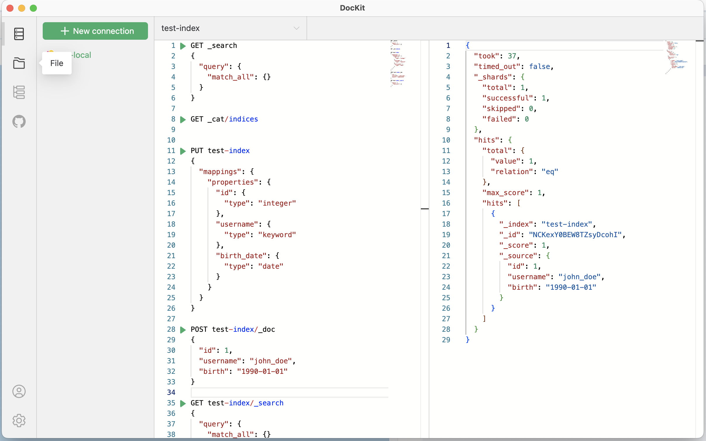

<div align="center">
<a href="https://github.com/geek-fun/dockit"></a>
</div>
<h1 align="center">DocKit</h1>
<div align="center">

[](https://github.com/geek-fun/dockit/actions/workflows/node.yml)
[](https://github.com/geek-fun/dockit/actions/workflows/release.yml)
[](https://snyk.io/test/github/geek-fun/dockit)
[](https://codecov.io/gh/geek-fun/dockit)
[](https://badge.fury.io/gh/geek-fun%2Fdockit)
[](https://opensource.org/licenses/Apache-2.0)

<strong>DocKit is a desktop client designed for NoSQL database, support Elasticsearch, OpenSearch and DynamoDB across Mac, windows and Linux.</strong>

</div>

## Client



## Feature

- Full-featured editor, Powered by monaco-editor the backbones of vscode, provide familiar editor environment for developers
- Keep your connections, Keep your connections in desktop apps, move the dependencies of dashboard tools
- File persistence, Save your code in your machine as file, never lost
- Multi engines support, Support Elasticsearch, OpenSearch, DynamoDB, and more to come

## Roadmap

| Database           | Status         | Progress        |
| ------------------ | -------------- | --------------- |
| 🔍 Elasticsearch   | ✅ Supported   | 🟢🟢🟢 Complete |
| 🔎 OpenSearch      | ✅ Supported   | 🟢🟢🟢 Complete |
| 🗄️ DynamoDB        | ✅ Supported   | 🟢🟢🟢 Complete |
| 🍃 MongoDB         | 🚧 In Progress | 🟡🟡⚪ Planning |
| ☁️ Azure Cosmos DB | 📋 Planned     | 🟡⚪⚪ Upcoming |

## Installation

Available to download for free from [here](https://github.com/geek-fun/dockit/releases).

## Build Guidelines

### Prerequisites

- Node.js >= 20
- NPM >= 10

### Clone the code

```bash
git clone https://github.com/geek-fun/dockit.git --depth=1
```

### Install dependencies

```bash
npm install
```

### Compile and run

```bash
npm run tauri dev
```

## Styling Architecture

The project uses **shadcn-vue** (built on Radix Vue) for UI components and **UnoCSS** for utility-first styling.

### Current Setup

1. **UnoCSS** - Atomic CSS utilities loaded via `virtual:uno.css` in `src/main.ts`
2. **shadcn-vue** - Headless UI components in `src/components/ui/` with CSS variable theming via `src/assets/styles/index.css`

### Style Entry Points

- `src/main.ts` - Main entry point importing all style layers
- `src/assets/styles/index.css` - Theme CSS variables and base styles (single source of truth)
- `uno.config.ts` - Unified UnoCSS configuration with all presets and theme tokens

### Theme Configuration

Brand colors and design tokens are defined via CSS variables in `src/assets/styles/index.css` (with light/dark mode support) and referenced in `uno.config.ts` for UnoCSS utilities.

## About

### Wechat Official Account


### Sponsor

If this project helpful for you, feel free to buy me a cup of coffee ☕️.

- Github Sponsor  
  [](https://github.com/sponsors/[geek-fun])

- Wechat Sponsor  
  
