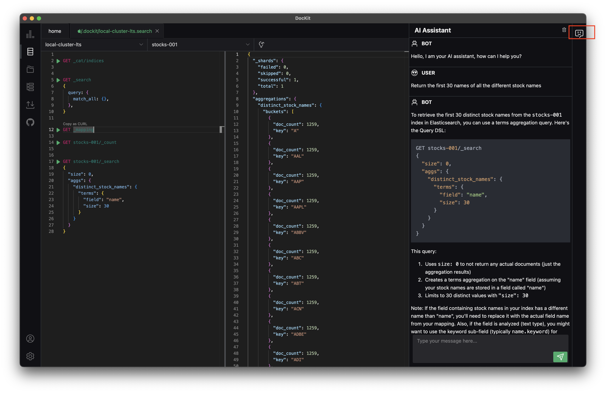
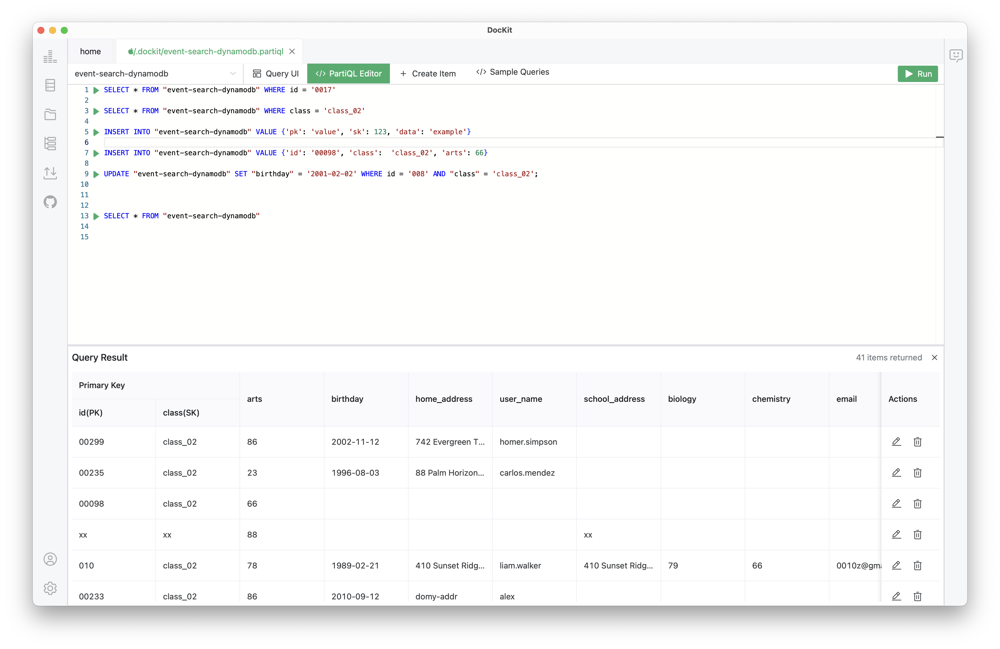

<div align="center">


# DocKit

**AI-native desktop client for NoSQL databases. Write queries in natural language. Manage DynamoDB, Elasticsearch, and OpenSearch from one interface.**
**Fast. Local-first. No cloud dependencies.**

[](https://github.com/geek-fun/dockit/releases)
[](https://github.com/geek-fun/dockit/releases)
[](https://opensource.org/licenses/Apache-2.0)
[](https://github.com/geek-fun/dockit/stargazers)
[](https://github.com/geek-fun/dockit/actions/workflows/node.yml)

[Website](https://www.geekfun.club/dockit/) · [Docs](https://www.geekfun.club/docs/dockit/) · [Download](https://www.geekfun.club/download) · [Releases](https://github.com/geek-fun/dockit/releases)

</div>

## Features

DocKit is an open-source desktop GUI client for NoSQL databases. It replaces browser-based consoles and proprietary tools with a native app built on [Tauri](https://tauri.app/) + Vue 3 + [shadcn-vue](https://www.shadcn-vue.com/) + [UnoCSS](https://unocss.dev/).

- **AI-powered queries.** Describe what you need and get accurate DynamoDB PartiQL or Elasticsearch queries. Schema aware. Bring your own OpenAI or DeepSeek key.
- **Unified interface.** DynamoDB, Elasticsearch, OpenSearch — one app, zero context switching.
- **Local-first.** Connections, queries, and history live on your machine. Zero telemetry. Works offline.

### AI Assistant

Ask "find users who signed up last week" or "aggregate sales by region" and get the query. Not just autocomplete. DocKit reads your table schemas and generates queries that actually run. Built-in support for OpenAI and DeepSeek.

### DynamoDB

- **Visual Query Builder.** Scan and query tables without writing code. Primary key filtering, advanced conditions, all from the UI.
- **PartiQL Editor.** SQL-like syntax with autocomplete, syntax highlighting, and document formatting.
- **Inline editing.** Update and delete items directly from query results.
- **Table management.** Browse tables, manage indexes, check capacity and item counts.
- **DynamoDB Local.** Point it at a local instance and develop offline. No AWS credentials needed.

### Elasticsearch & OpenSearch

- **Monaco Editor.** Same engine as VS Code. Syntax highlighting, autocomplete, your keyboard shortcuts.
- **Cluster management.** Node health, shard state, index tracking, alias control.
- **API key authentication.** Native Elasticsearch API key support.

### Query History

DocKit records every query as you run it. No save button. 500 entries per connection, stored on your machine. Copy a past query, load it back into the editor, or re-execute it. Covers PartiQL statements and visual UI form queries.

### Import & Export

JSON, CSV, JSONL. Batch operations handle millions of records. Move data between clusters, back up tables, or seed development environments.

### Privacy & Security

- DocKit does not phone home. No query data, no credentials, no analytics leave your machine.
- Connection profiles are encrypted by your OS keychain.
- No internet connection required. Air gap compatible.

## Screenshots

| AI Assistant | Query History |
|:---:|:---:|
|  |  |

| DynamoDB Visual Query | PartiQL Editor |
|:---:|:---:|
|  |  |

## Supported Databases

| Database | Status |
|---|---|
| Elasticsearch | Supported |
| OpenSearch | Supported |
| DynamoDB | Supported |
| MongoDB | In Progress |
| Azure Cosmos DB | Planned |

## Installation

| Platform | Download |
|---|---|
| **macOS** (Universal) | [DocKit\_universal.dmg](https://github.com/geek-fun/dockit/releases/latest) |
| **Windows** (x64) | [DocKit\_x64-setup.exe](https://github.com/geek-fun/dockit/releases/latest) |
| **Linux** (AppImage / deb) | [DocKit\_amd64.AppImage](https://github.com/geek-fun/dockit/releases/latest) |

All versions on the [releases page](https://github.com/geek-fun/dockit/releases).

## Development

### Prerequisites

- Node.js >= 20
- NPM >= 10
- Rust toolchain (for Tauri)

### Setup

```bash
git clone https://github.com/geek-fun/dockit.git --depth=1
cd dockit
npm install
npm run tauri dev
```

### Build

```bash
npm run tauri build          # current platform
npm run build:macos          # macOS Universal
```

### Tech Stack

| Layer | Technology |
|---|---|
| Desktop Shell | [Tauri](https://tauri.app/) (Rust) |
| Frontend | Vue 3 + TypeScript |
| UI Components | [shadcn-vue](https://www.shadcn-vue.com/) (Radix Vue) |
| Styling | [UnoCSS](https://unocss.dev/) |
| Editor | [Monaco Editor](https://microsoft.github.io/monaco-editor/) |
| State | Pinia |

## Contributing

Issues and PRs welcome. Check the [contribution guide](CONTRIBUTION.md).

## Community


## Sponsor

[GitHub Sponsors](https://github.com/sponsors/geek-fun) if DocKit helps your work.


## License

[Apache 2.0](LICENSE) © GEEKFUN
