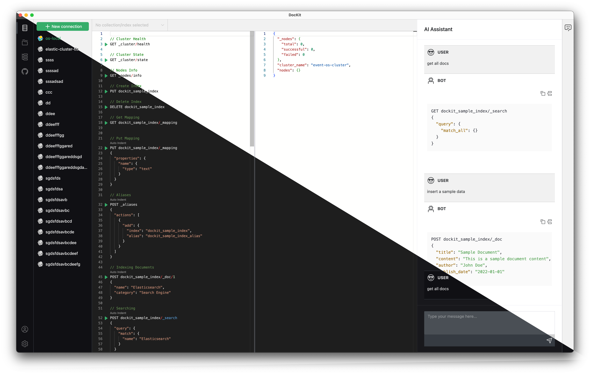

<div align="center">
<a href="https://github.com/geek-fun/dockit"></a>
</div>
<h1 align="center">DocKit</h1>
<div align="center">


[](https://github.com/geek-fun/dockit/actions/workflows/node.yml)
[](https://github.com/geek-fun/dockit/actions/workflows/release.yml)
[](https://snyk.io/test/github/geek-fun/dockit)
[](https://codecov.io/gh/geek-fun/dockit)
[](https://badge.fury.io/gh/geek-fun%2Fdockit)
[](https://opensource.org/licenses/Apache-2.0)


<strong>DocKit is a modern cross-platform NoSQL/NewSQL GUI client. Explore your data any time from your Mac, Windows, and
Linux.</strong>
</div>

## Client


## Feature

* Full-featured editor, Powered by monaco-editor the backbones of vscode, provide familiar editor environment for developers
* Keep your connections, Keep your connections in desktop apps, move the dependencies of dashboard tools
* File persistence, Save your code in your machine as file, never lost
* Multi engines support,Support Elasticsearch, OpenSearch, and more to come
## Roadmap

- [ ] ZincSearch support
- [ ] Multi-file support

## Installation

Available to download for free from [here](https://github.com/geek-fun/dockit/releases).

## Build Guidelines

### Prerequisites

* Node.js >= 16
* NPM >= 9

### Clone the code

```bash
git clone https://github.com/geek-fun/dockit.git --depth=1
```

### Install dependencies

```bash
npm install
```

### Compile and run

```bash
npm start
```
## About

### Sponsor
