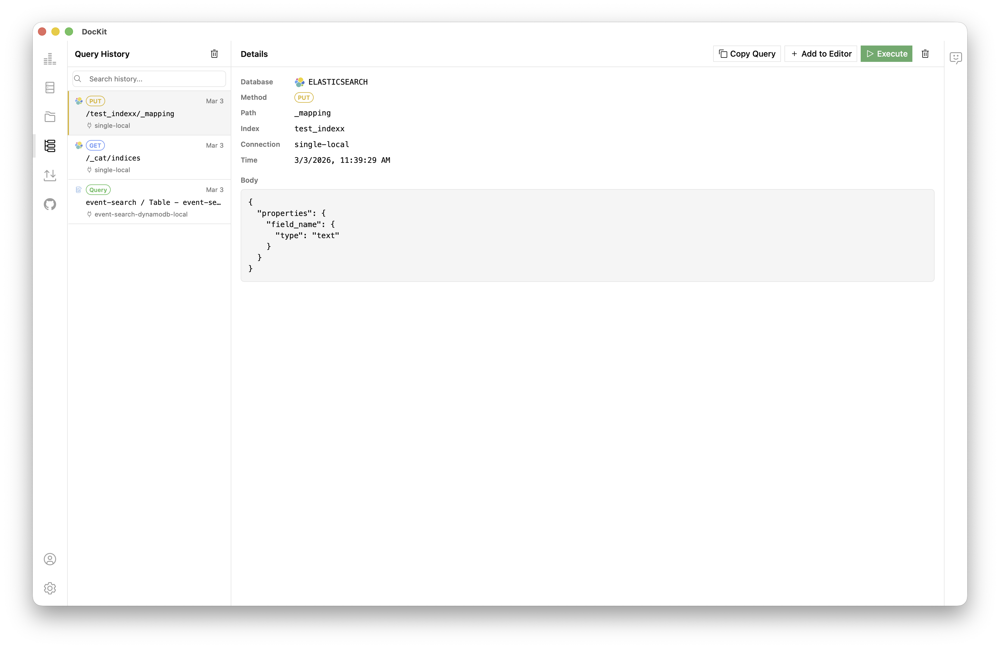
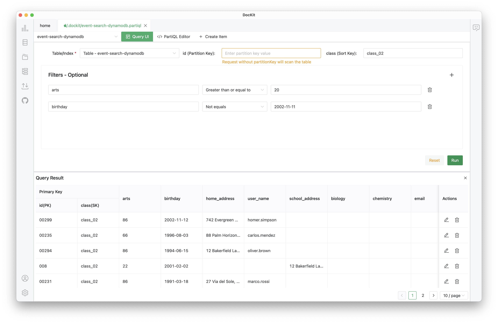

<div align="center">


# DocKit

**Elasticsearch、OpenSearch、DynamoDB 和 MongoDB 的开源 GUI 客户端 —— 一个原生桌面应用管理所有 NoSQL 数据库。**

**隐私优先。您的数据，您的密钥。开源开放。**

[](https://github.com/geek-fun/dockit/releases)
[](https://github.com/geek-fun/dockit/releases)
[](https://opensource.org/licenses/Apache-2.0)
[](https://github.com/geek-fun/dockit/stargazers)
[](https://github.com/geek-fun/dockit/actions/workflows/node.yml)

[官网](https://www.geekfun.club/products/dockit/) · [文档](https://www.geekfun.club/docs/dockit/) · [下载](https://www.geekfun.club/download) · [Releases](https://github.com/geek-fun/dockit/releases)

</div>

---

DocKit 用一个原生桌面应用替代 Kibana 和 AWS Console 等浏览器控制台。用自然语言描述需求，即可生成可执行的查询；也可以直接使用 Monaco 驱动的编辑器。支持 OpenAI、Anthropic 和 DeepSeek —— 自带密钥即可使用。

<table align="center" border="0">
  <tr align="center">
    <td><br>Elasticsearch</td>
    <td><br>OpenSearch</td>
    <td><br>DynamoDB</td>
    <td><br>MongoDB</td>
    <td><br>EasySearch</td>
  </tr>
</table>

## 截图

| AI 助手 | 查询历史 |
|:---:|:---:|
|  |  |

| DynamoDB 可视化查询 | PartiQL 编辑器 |
|:---:|:---:|
|  |  |

## 主要功能

### Agentic Data Studio

DocKit 的数据代理让你通过自然语言与数据库交互。描述你的需求 —— 代理会编写查询、检查表结构、更新文档、删除记录、创建索引并返回结果。每个操作都通过经过验证的工具执行，内置安全机制：细粒度的按源权限、破坏性操作需要显式确认的安全门，以及绝不会向 LLM 暴露连接凭据的安全架构。支持 OpenAI、Anthropic 和 DeepSeek。

### 管理与监控

每个支持的数据库都有交互式管理面板。监控节点健康、分片状态、索引状态和存储指标。管理索引、别名、表配置和集合元数据 —— 全部通过可视化界面完成。无需命令行。

### DynamoDB

支持扫描和查询操作的可视化查询构建器，包含主键过滤和高级条件。PartiQL 编辑器，支持自动补全和语法高亮。在结果中直接内联编辑、更新和删除条目。完整的表生命周期管理 —— 浏览、创建、修改表，管理索引，监控容量和条目数。支持 DynamoDB Local，无需 AWS 凭据即可离线开发。

### MongoDB

支持认证、TLS 和副本集配置连接。功能完备的查询编辑器，支持自动补全和结果格式化。文档浏览器，支持分页和内联 CRUD。管理视图，可查看索引、存储统计和集合元数据。支持批量写入。查询历史支持星标/收藏，按连接持久保存。支持以 JSON、CSV 和 JSONL 格式导入导出集合。

### Elasticsearch & OpenSearch

作为独立的连接类型，各自拥有独立的配置。Monaco 驱动的编辑器，支持完整的语法高亮和自动补全。集群管理 —— 节点健康、分片状态、索引跟踪、别名控制。原生支持 Elasticsearch 和 OpenSearch 的 API Key 认证。

### 查询历史

每次查询自动记录。无需手动保存。每个连接保存 500 条，存储在本地。可复制、重新载入编辑器或重新执行。涵盖 PartiQL、MongoDB 和可视化表单查询。

### 导入导出

支持 JSON、CSV、JSONL 格式。批量操作可处理数百万条记录。在集群间迁移数据、备份表或初始化开发环境。

### 隐私与安全

DocKit 不会回传任何数据。查询内容、凭据或分析数据都不会离开你的电脑。连接信息通过系统密钥链加密存储。无需互联网连接 —— 支持离线环境。

### 无障碍

完整的键盘导航 —— Tab 切换交互元素，方向键在列表和树中导航，回车/空格激活。操作按钮和查询结果完全键盘可达。支持屏幕阅读器。

## 开发
DocKit 使用 [Tauri](https://tauri.app/) (Rust)、Vue 3 + TypeScript、[shadcn-vue](https://www.shadcn-vue.com/)、[UnoCSS](https://unocss.dev/)、[Monaco Editor](https://microsoft.github.io/monaco-editor/) 和 Pinia 构建。

### 环境要求

- Node.js >= 20
- NPM >= 10
- Rust 工具链（用于 Tauri）

### 本地运行

```bash
git clone https://github.com/geek-fun/dockit.git --depth=1
cd dockit
npm install
npm run tauri dev
```

### 构建

```bash
npm run tauri build          # 当前平台
npm run build:macos          # macOS Universal
```

## 贡献

欢迎提交 Issue 和 PR。请查阅[贡献指南](CONTRIBUTION.md)。

## 社区与赞助

<div style="text-align: left;">
  <div style="display: inline-block; vertical-align: top; margin: 0 120px 0 0;">
    
  </div>
  <div style="display: inline-block; vertical-align: top;">
    <br><br>
    <a href="https://github.com/sponsors/geek-fun">GitHub Sponsors</a> — 如果 DocKit 对你的工作有帮助，欢迎赞助。
  </div>
</div>

## 许可证

[Apache 2.0](LICENSE) © GEEKFUN
